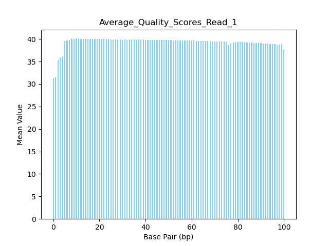
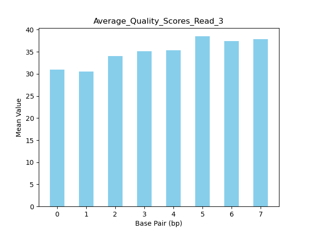
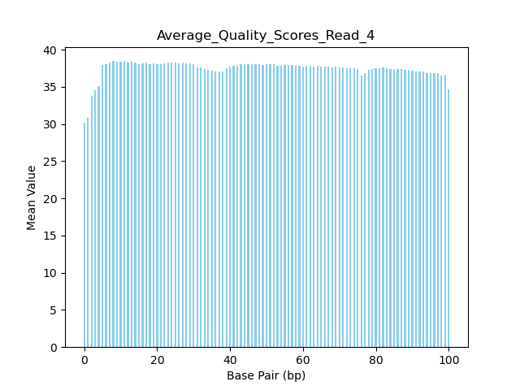

# Assignment the First

## Part 1
1. Be sure to upload your Python script. Provide a link to it here: 

https://github.com/claire-j-wells/Demultiplex/blob/master/Assignment-the-first/avg_qual.py

| File name | label | Read length | Phred encoding |
|---|---|---|---|
| 1294_S1_L008_R1_001.fastq.gz | read 1 | 101 | phred+33 |
| 1294_S1_L008_R2_001.fastq.gz | index 1 | 8 | phred+33 |
| 1294_S1_L008_R3_001.fastq.gz | index 2 | 8 | phred+33 |
| 1294_S1_L008_R4_001.fastq.gz | read 2 | 101 | phred+33 |

2. Per-base NT distribution
    1. Use markdown to insert your 4 histograms here.

| | | 
|---|---|
|  |  |
| |  | 


2. For biological read pairs, we don't necessarily need to assign a quality score cutoff because following this process we will be doing alignment and the alignment algorithm takes care of sequences that don't have a good enough quality score. Therefore, we could assign the quality score cutoff for sequences to be less strict, but we could assign it to be 30 based on the average quality score graph. For the index reads, we would assign an quality score cutoff to be 30 based on the Illumina suggestion. We can also justify this cutoff based on the index graphs. We chose 30 because if the quality score cutoff is too low, we are increasing the chances of introducing low quality bases that could be a false sample assignment. Additionally, according to Illlumina, a phred score of Q30 gives a 99.9% base call accuracy which is sufficient in this context. 

    
    3. 
    ```
    Index 1:
    zcat 1294_S1_L008_R2_001.fastq.gz | sed -n '2~4p'| grep -c 'N'

    output: 3976613
    ```
    ```
    Index 2:
    zcat 1294_S1_L008_R3_001.fastq.gz | sed -n '2~4p'| grep -c 'N'

    output: 3328051
    ```
    
  
## Part 2
1. Define the problem
There are a few problems. We are given four fastq files (R1,R2,R3,R4). R1 and R4 are Read 1 and Read 2 and R2 and R3 are Index 1 and Index 2 respectively. These indexes are used to match the reads in each sample. We are also given a list of 24 indexes that are known and used to generate the RNA sequence data. 

The end goal of this is to demultiplex the data. This means we need to get the reads from R1 and R4 and get those reads into their own designated files labeled by matching index (ex: AAAA-AAAA_R2.fq). R1 will go into an index_R1.fq file, this will be a collection of records from R1 only and R2 will go into another seperate file of index_R2.fq. There will be 24 different files times 2 because there is both R1 and R4 files to parse through for a total of 48 files. 

In addition, we will also have a unk_R1.fq and a unk_R2.fq folder. In this folder, we will have records that do NOT match against the set of 24 given indexes. This includes anything that has an "N" in it. IF the indexes are identical, then they will go into the index_R2.fq and index_R1.fq files mentioned above. IF the indexes are not identical BUT did match with the set of 24 given indexes in some way, then they will go into it's own designated folder of index hopping called hopped_R1.fq and hopped_R2.fq. 

2. Describe output <br>

For the output, we will have 52 total files. <br>
For the files that have matching indexes to the given list of indexes, they will have their own files designated as `index_R1.fq` and `index_R2.fq`. In place of index, the matched up indexes will be the title of these FQ files. 

We will have another set of files for indexes that are present in our list of 24 but do *NOT* match one another. This will be designated as index hopping and will be in a designated `hopped_R1.fq` and `hopped_R2.fq` folder. Finally, we have files for unknown and those are for reads that do not meet quality score requirements and/or are not in the index of known indexes. 

3. Upload your [4 input FASTQ files](../TEST-input_FASTQ) and your [>=6 expected output FASTQ files](../TEST-output_FASTQ).

4. Pseudocode

Note: Refer to written out flowchart of pseudo-code for visual reference
Given: 
---
- Four files and a list of all the known indexes:  

Files and Labels:
| File name | label | 
|---|---|
| 1294_S1_L008_R1_001.fastq.gz | read 1 | 
| 1294_S1_L008_R2_001.fastq.gz | index 1 | 
| 1294_S1_L008_R3_001.fastq.gz | index 2 | 
| 1294_S1_L008_R4_001.fastq.gz | read 2 | 

List of Known Indexes: 

```
B1	GTAGCGTA    A5	CGATCGAT    C1	GATCAAGG
B9	AACAGCGA    C9	TAGCCATG    C3	CGGTAATC
B3	CTCTGGAT    C4	TACCGGAT    A11	CTAGCTCA
C7	CACTTCAC    B2	GCTACTCT    A1	ACGATCAG
B7	TATGGCAC    A3	TGTTCCGT    B4	GTCCTAAG
A12	TCGACAAG    C10	TCTTCGAC    A2	ATCATGCG
C2	ATCGTGGT    A10	TCGAGAGT    B8	TCGGATTC
A7	GATCTTGC    B10	AGAGTCCA    A8	AGGATAGC
```
1. We have R1, R2, R3 and R4. These are the primary files that we are working with. R1 and R4 contain reads 1 and reads 2 and R2 and R3 contain the indexes. 

```
with gzip.open(file, "rt") as fh 
    for line in fh 
    *use modulus to isolate specific sequence lines
```


2. The first thing we need to do is reverse complement the R3 indexes. If the indexes of R2 and R3 are matching, they **will** be the reverse complement of one another so in order to match them and prove they are matching we must write a function that will make these reverse complemented reads "un-reverse complemented". 

```
def reverse_complement_bases()
    input: str of rv complemented bases 
    output: str of bases 
```
   
2a. Between these two steps we also need to consider how the code would work to actually make headers and then attach them to the headers of every file

```
header = print(f'{index} - {rev_comp_index}')
```


3. Add Headers. Once the R3 indexes have been un-reverse complemented, we need to add headers to R1 and R4. The headers might look something like this: `AAA-AAA` The second AAA is the converted form of the original reverse complemented TTT that is originally displayed in the R3 file. 

```
#Goal: Add headers to everything that way it doesn't become an issue downstream!

def index_seq_to_header(): 
    input: f-string header? 
    output: new files with new headers 
```


4. We will now check our indexes against the given available list of indexes using the headers we added to R1 and R4 in the step above. 

```
if header == given_index:
    keep going to check qual_score 
elif header != given_index:
    goes to unknown
elif....(not sure how I would form this statement atm)
    *goes of this statement would be to see if index hopping is occurring

```

5. If an index contains an N or does not match the given list of indexes, the record will be considered unknown. These records will be stored in a file named: `Unk_R1.fq` and `Unk_R2.fq`

6. If R2 index and R3 index (converted) match one another and are in the given list of indexes, it will move on to be checked for its quality score. More on this continued in Step 8. 

7. If the record is in the given list of indexes but DOES NOT match its complement, then this is considered index hopping and will go into a designated folder called `hopped_R1.fq` and `hopped_R2.fq`

8. The records that have matching indexes must be checked for their quality score. If they pass the quality threshold, they will be placed in designated folders called `index_R1.fq` and `index_R2.fq`. These files will be labeled appropriately with the matching index. 

Notes: No QS threshold has been established yet. 

Potential functions to be used/written: 

```
def index_seq_to_header(seq:str) -> seq: <br>
```This function takes an index sequence and makes a header out of it```
return(new_header)

def reverse_complement_bases(seq:str) -> str:
```This function takes a string of bases and converts them from reverse complements to "normal"```
    input: str of rv complemented bases 
    output: str of bases 
return(coverted_string)

def write_record_to_file(record:str)-> unsure of what output would be <br>
```This function takes the record and writes it to the designated file of choice```
return()

def calc_qual_score(char:str)->int: <br>
```This function calculates quality score by using the convert_phred function too```
return(qual_score)
```


**Did not include test examples for individual functions as they're still in the works 

5. High level functions. For each function, be sure to include:
    1. Description/doc string
    2. Function headers (name and parameters)
    3. Test examples for individual functions
    4. Return statement
See functions above!
